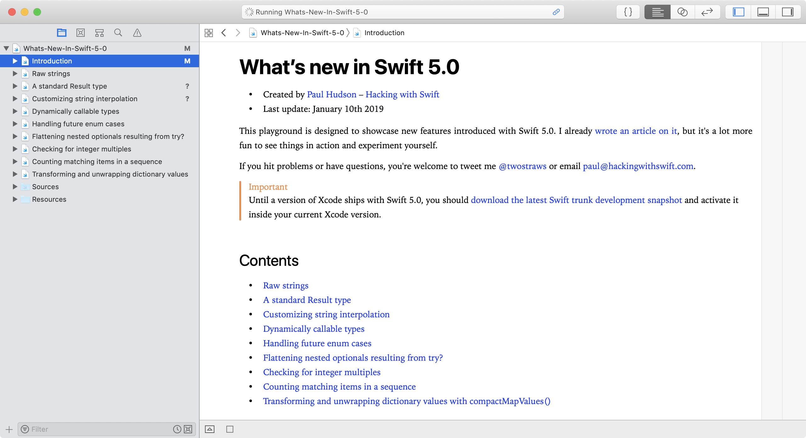

# What’s new in Swift 5.0?

This is an Xcode playground that demonstrates the new features introduced in Swift 5.0: 

* Raw strings
* A standard `Result` type
* Customizing string interpolation
* Dynamically callable types
* Handling future enum cases
* Flattening nested optionals resulting from `try?`
* Checking for integer multiples
* Transforming and unwrapping dictionary values with `compactMapValues()`

This is designed to complement my existing article [What’s New in Swift 5.0](https://www.hackingwithswift.com/articles/126/whats-new-in-swift-5-0). You might also want to read [What’s New in Swift 4.2](https://www.hackingwithswift.com/articles/77/whats-new-in-swift-4-2) and [What's New in Swift 4.1](https://www.hackingwithswift.com/articles/50/whats-new-in-swift-4-1). Alternatively, I have a whole website dedicated to tracking [what's new in Swift](https://www.whatsnewinswift.com) – you should check it out at <https://www.whatsnewinswift.com>.

If you hit problems or have questions, you're welcome to tweet me [@twostraws](https://twitter.com/twostraws) or email <paul@hackingwithswift.com>.

